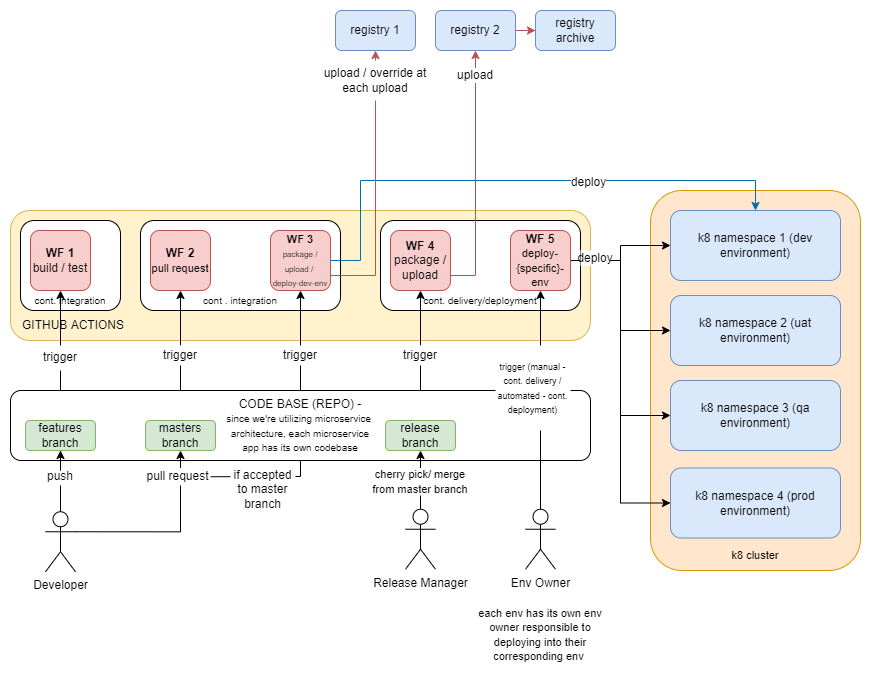
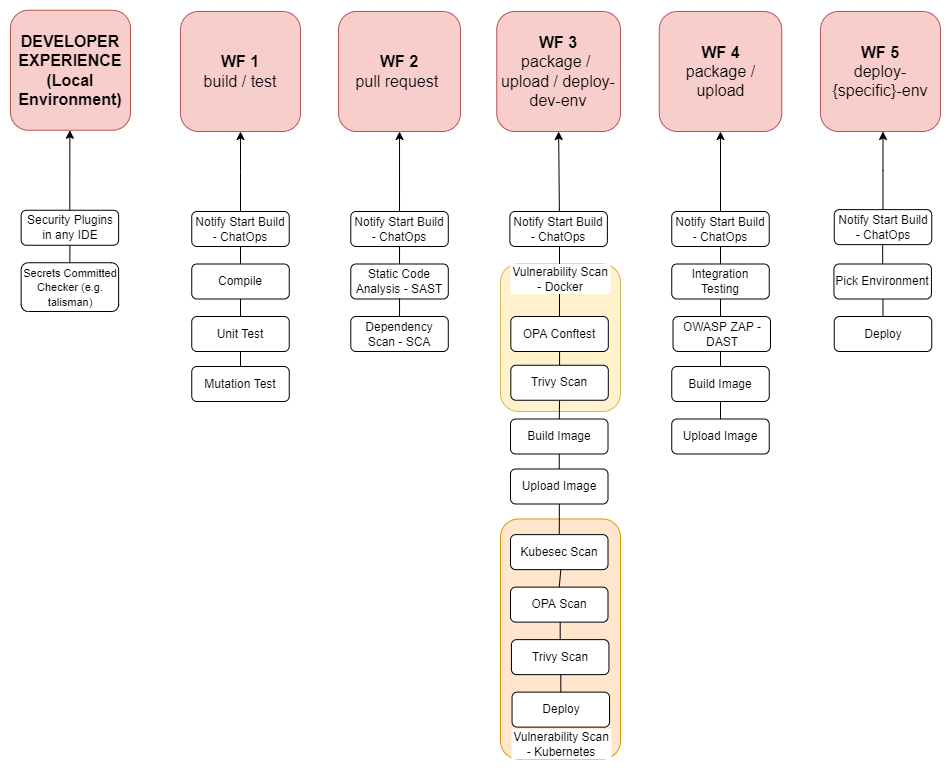

# Overview 
## CICD Pipeline Design

## Diving Deep into the Workflows

# Tips
## Setting up a local environment
* Clone the repository 
* Add all gh actions credentials at {repository} > settings > secrets > actions 
* Execute "npm run install" to install all dependencies in your local machine 
* Use act to run without committing to remote repository, refer to this documentation: https://github.com/nektos/act